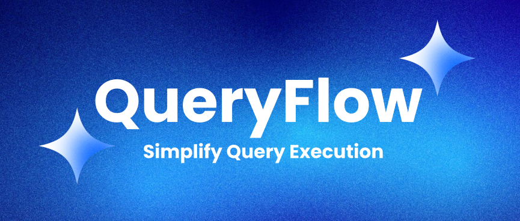
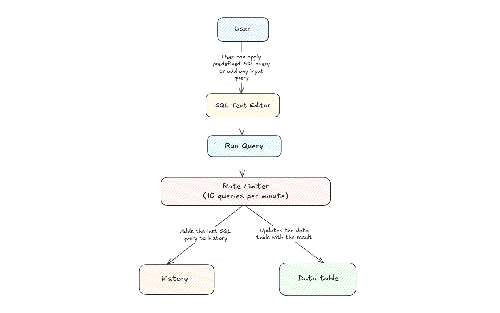

# [QueryFlow](https://query-flow-xi.vercel.app)



> Execute your Queries with ease

## Project Overview

QueryFlow is an application that allows users to write, execute, and manage SQL queries with a focus on usability, performance, and advanced functionality. Core features include a SQL query editor for executing queries, a dropdown for selecting predefined queries, and a table for displaying data. Additional features include query history, CSV export, virtualization to render large datasets, and dark mode to enhance the user experience. The project showcases various functionalities, performance optimizations, and a user-focused layout design.

## Flow Diagram



## Core Features

- **SQL Query Editor**: Write SQL queries using `AceEditor` with MySQL syntax highlighting, auto-completion and theme support.
- **Dropdown Predefined Query Selector**: Select and execute predefined queries from a dropdown list.
- **Table to Display Data**: View query results in a responsive table.

## Additional Features

- **Query History**: Access the last 5 executed queries from the history list.
- **CSV Export**: Export query results as a CSV file.
- **Virtualized Table**: Efficiently render large datasets using react-window without impacting browser performance.
- **Dark Mode**: Switch between light and dark themes for enhanced accessibility.

## JavaScript Framework and Dependencies

- **Framework**:
  - **React.js**: JavaScript framework used to build user interfaces.
  - **TypeScript**: Superset of JavaScript for type safety.
- **Major Plugins and Packages**:
  - `"react-window": "^1.8.11"`: For virtualized tables to handle large datasets.
  - `"react-table": "^7.8.0"`: For rendering tabular data.
  - `"react-ace": "^14.0.1"`: For the query editor with syntax highlighting.
  - `"papaparse": "^5.5.2"`: For CSV export functionality.
  - `"sonner": "^2.0.2"`: For toast notifications.
  - `"@mui/icons-material": "^6.4.8"`: For adding icons.
  - `"@mui/material": "^6.4.8"`: For responsive, theme-aware UI components.

## Deployment Platform
- **Vercel** - Deployment platform for frontend

## Deployed Link

- [QueryFlow Website](https://query-flow-xi.vercel.app/)

## Page Load Time


- **Measurement**: The page load time was measured using Chrome DevTools' **Lighthouse** tool
- **Result**: The page load time is approximately **0.4 seconds** to **1.0 seconds**.
- **How It Was Measured**:
  - Opened Chrome DevTools, navigated to the Lighthouse tab, and ran a performance audit with the following settings:
  - Recorded the TTI metric from the Lighthouse report.

## Performance Optimizations

Several optimizations were applied to decrease load time and increase overall performance:

- **Lazy Loading**: Lazy-loaded components using `React.lazy` and `Suspense`, reducing the initial bundle size.
- **Suspense Fallbacks**: Added loading states for lazy-loaded components to enhance user experience.
- **Component Splitting**: Split code into smaller components to minimize re-renders and improve responsiveness.
- **Static Styles in CSS**: Moved static styles to `App.css`, reducing First Contentful Paint (FCP).

## Pros and Cons of Proposed Solution

### Pros

- Includes core features like query editor, selector, and table, plus advanced ones like history and CSV export.
- Virtualized table handles 1,000 rows efficiently using react-window
- AceEditor, dark mode, and responsive design enhance usability.
- TypeScript, modular structure, and JSDoc comments improve maintainability.

### Cons

- Currently supports basic SELECT \* FROM table queries.
- Uses mock data instead of a retrieving from backend server.

## Solution Future Aspects

- Add more robust query validation (e.g., using a SQL parser).
- Replace mock data with actual backend server to execute queries against a database.

## Setup Instructions for Local development

1. **Clone the Repository**:

   ```bash
   git clone https://github.com/Shreekar11/QueryFlow.git
   cd QueryFlow
   ```

2. **Install Dependencies**

   ```bash
   npm install --legacy-peer-deps
   ```

3. **Run the Development**

   ```bash
   npm run dev
   ```

## Contact

For any inquiries or support, please email us at shreekargade2004@gmail.com or open an issue in this repository.
